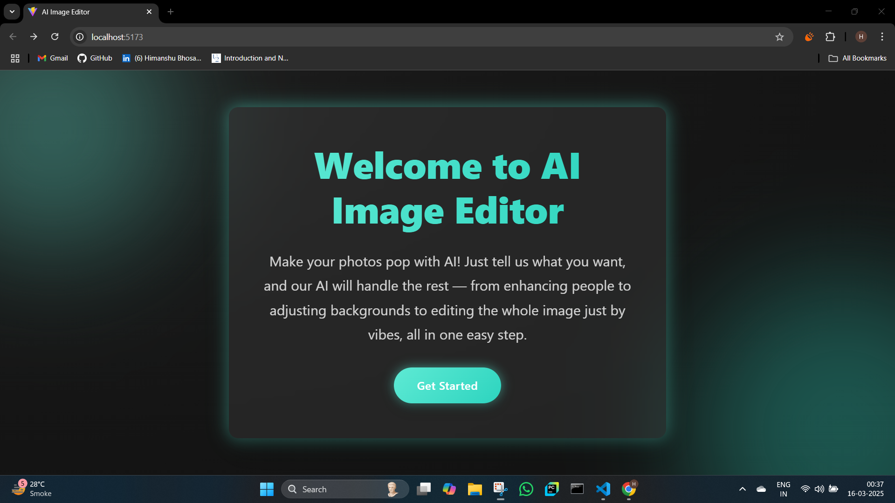
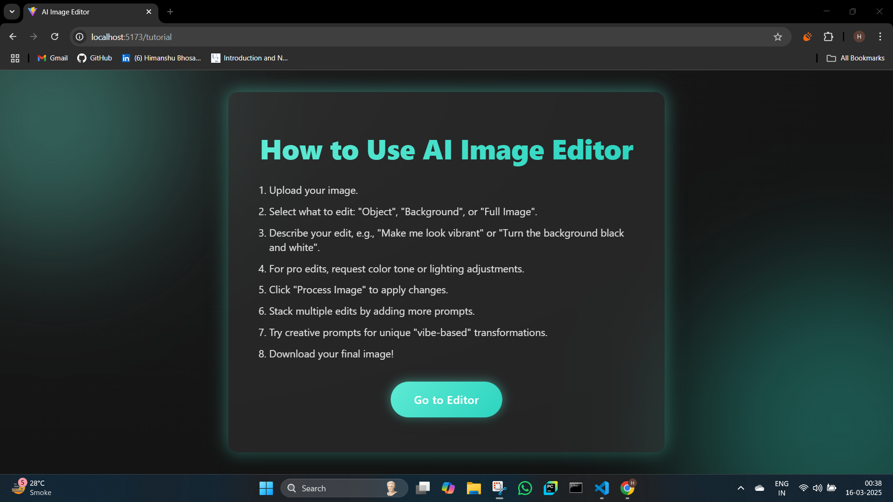
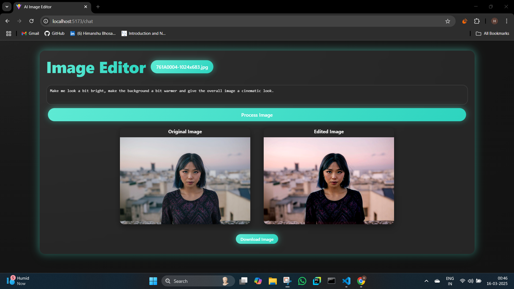
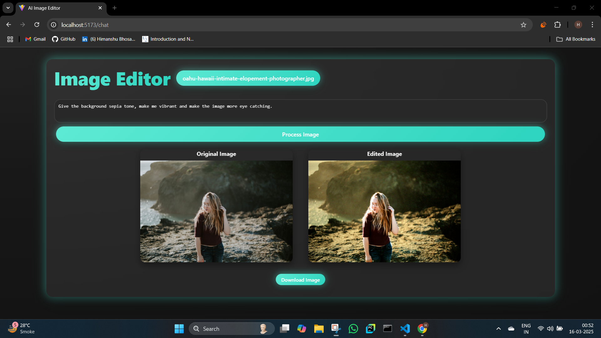
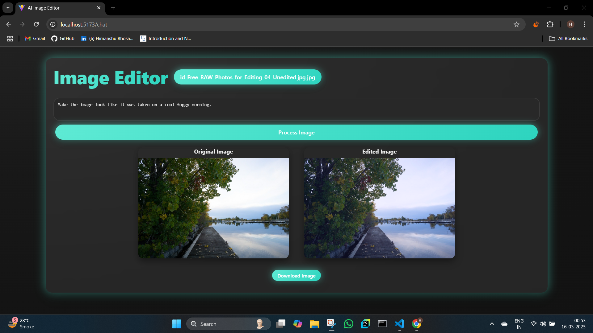
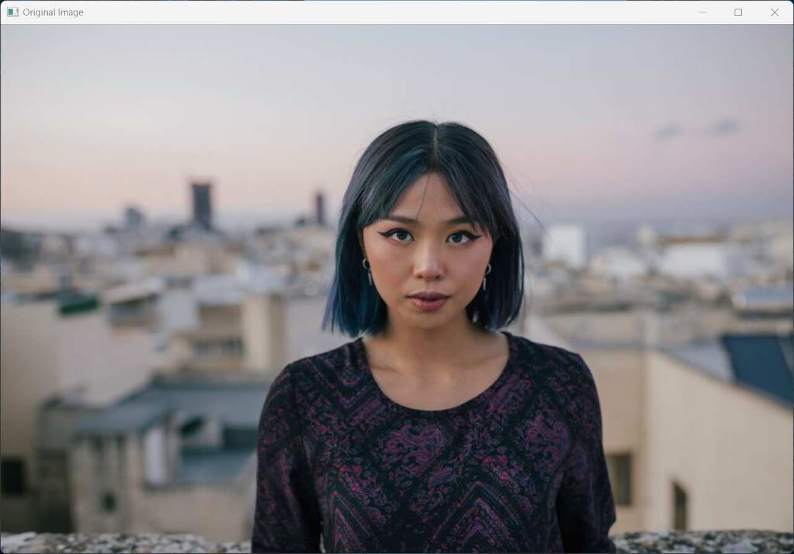
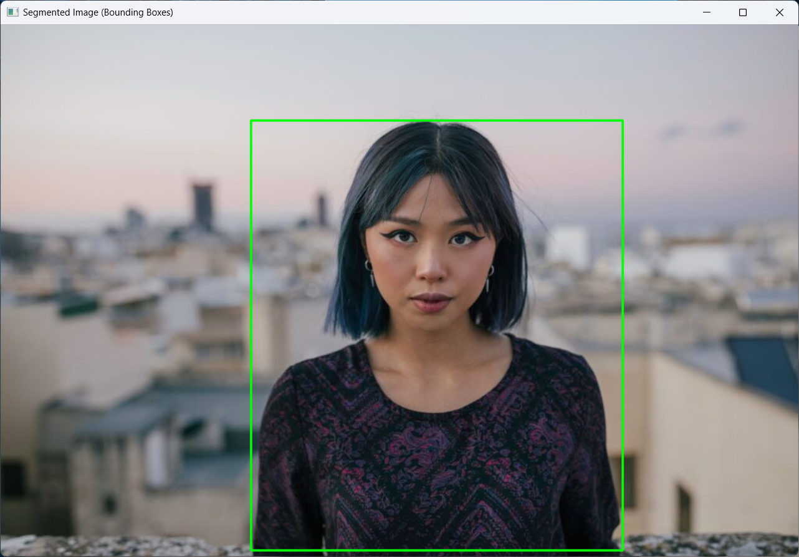
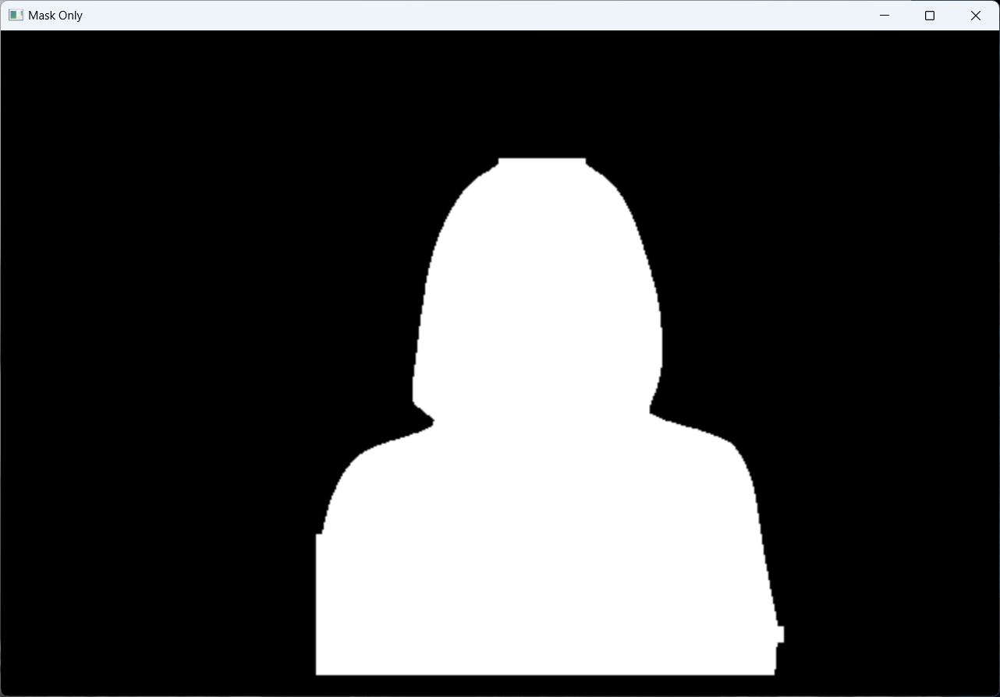

# AI Image Transformer: Deep Learning Powered Image Editing 🧠✨🌐

**Transform images with natural language prompts using AI. This project integrates powerful models for segmentation and prompt understanding, packaged in a user-friendly web interface. 🚀**

## Key AI Features 🌟

* **AI-Driven Image Manipulation:** Transform images with text prompts. 
* **Advanced Object Segmentation (yolov8l-seg):** Precise, targeted edits. 
* **Natural Language Understanding (deepseek-r1-distill-llama-70b):** Interprets user prompts. 
* **Sophisticated Masking & Blending (OpenCV):** Realistic results. 
* **End-to-End Deep Learning Pipeline:** Complete image transformation. 

## User-Friendly Web Interface (React) 🌐

* **Intuitive React Frontend:** Seamless user experience. 
* **Session-Based Editing:** Stack multiple edits. 
* **Real-time Previews:** Instant feedback. 
* **Download Functionality:** Easy image download. 
* **Responsive Design:** Works on all devices. 

## Screenshots of UI:📸

### **Welcome Screen:**
 


### **Tutorial:**



### **Example 1:**



### **Example 2:**



### **Example 3:**



## Segmentation and Masking:📸

### **Original Image:**



### **Object Detection:**



### **Object Making:**



## Getting Started (Focus on AI and Web Integration) 🏁

### Prerequisites 📋

* Node.js and npm (or yarn) installed for frontend development. 📦
* Python 3.11 with required deep learning and AI libraries (see Dependencies). 🐍
* A running backend server (see Backend Setup). ⚙️

### Installation 🛠️

1.  **Clone the repository:**

    ```bash
    git clone https://github.com/HimanshuBhosale25/YOLO-DeepSeek-Powered-Image-Manipulation-Tool.git
    cd ai-image-editor
    ```

2.  **Install frontend dependencies:**

    ```bash
    npm install
    ```

3.  **Run the frontend:**

    ```bash
    npm start
    ```

    Open your browser and navigate to `http://localhost:5173`. 🌐

4.  **Backend Setup:**

    * Navigate to the backend directory. 📂
    * Install backend dependencies (refer to backend documentation for specific instructions. Focus on the AI and deep learning libraries). ⬇️
    * Set the `GROQ_API_KEY` environment variable. 🔑
    * Run the FastAPI application (e.g., `uvicorn main:app --reload`). ▶️
    * Ensure the backend is accessible at `http://localhost:8000`. 🚀

### Usage (AI and Web Interaction) 💡

1.  **Upload an image:** (Using the web interface to provide input for the Large Language model). 🖼️
2.  **Enter a descriptive text prompt:** (To guide the AI's image editing process through the web interface). 📝
3.  **Process the image:** (Using the web interface to trigger the deep learning pipeline). ✅
4.  **View the results:** (Using the web interface to observe the AI's output). 👀
5.  **Download:** (Using the web interface to save the AI-processed image). 💾

## Technologies Used:📦

* **Backend (Python):**
    * FastAPI ⚡
    * Uvicorn 🦄
    * Pillow (PIL) 🖼️
    * OpenCV (cv2) 👁️
    * Ultralytics (YOLOv8) 🎯
    * Groq 🤖

* **Frontend (React):**
    * React ⚛️
    * React Router DOM 🛣️
    * Axios 📡


## Contributing (AI and Web Focus) 🤝

Contributions focused on improving the deep learning models, AI integration, image processing algorithms, and the user-friendly web interface are highly encouraged. 🐛✨📈

## License 📜

This project is licensed under the MIT License. 📝